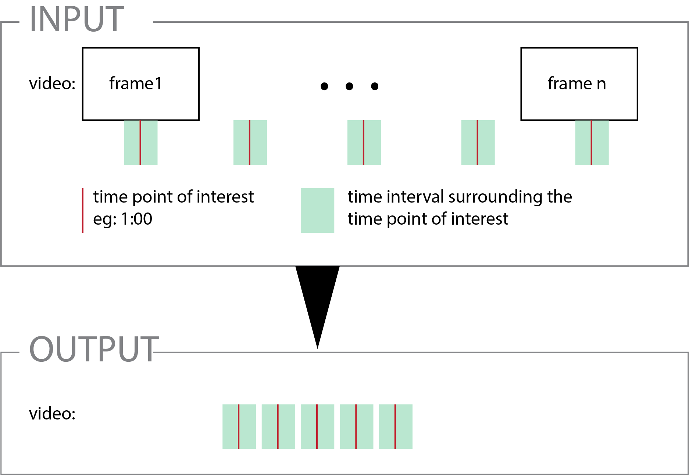
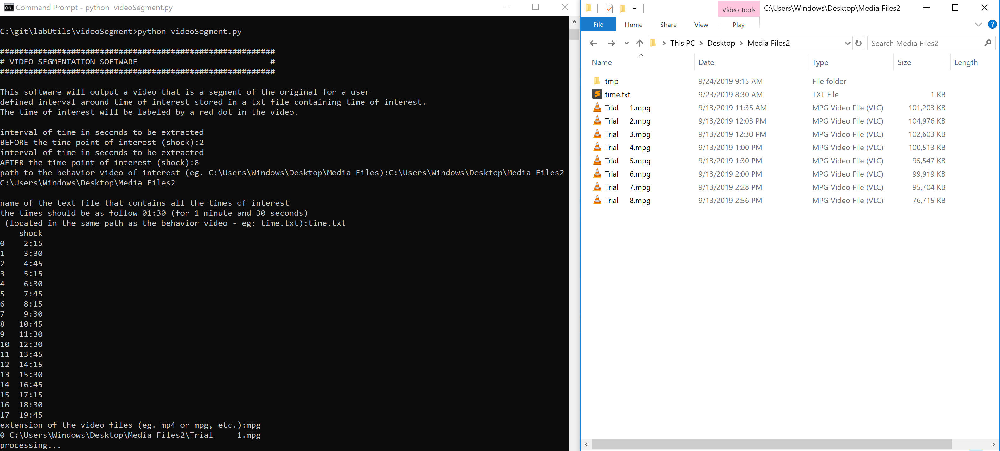

# videoSegment
documentation to be updated  
The transition between temporal sequence of interest is amphasize by a yellow flash on the output video.

### requirements
Anaconda is recommended [link](https://www.anaconda.com/distribution/)

### description

_graphical description_  

### usage
in command line/ terminal:  
 -navigate in the directory where the folder is located (using cd)  
 -then run the program with:  
 	python videoSegment.py

### screenshot input example

